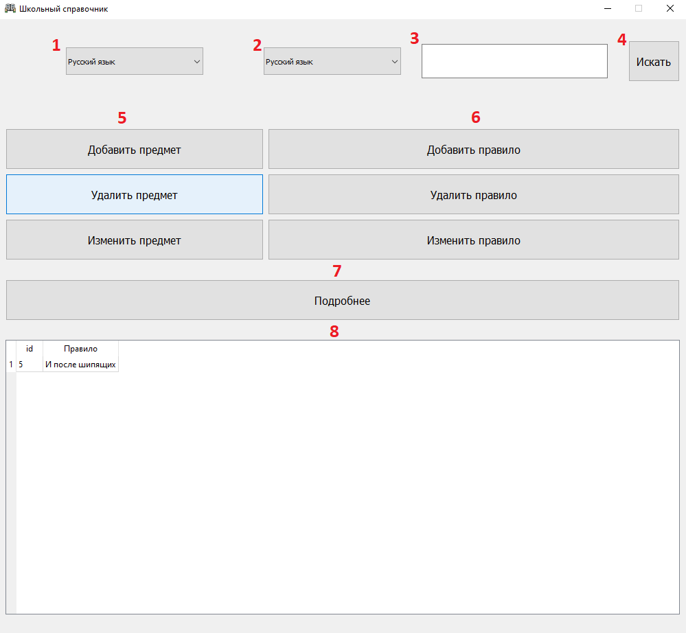
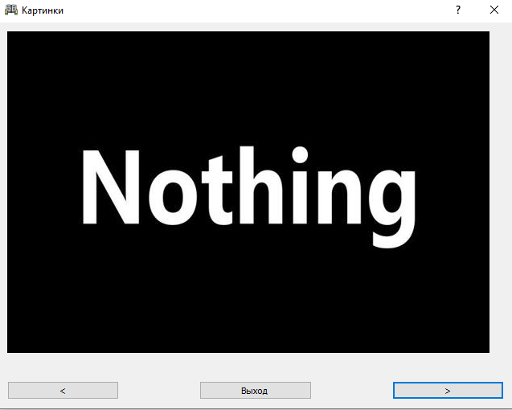
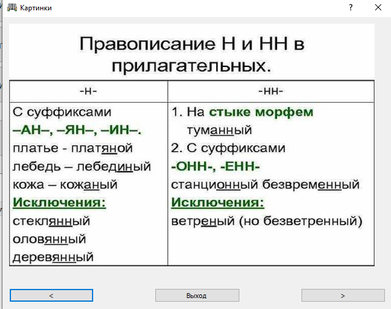
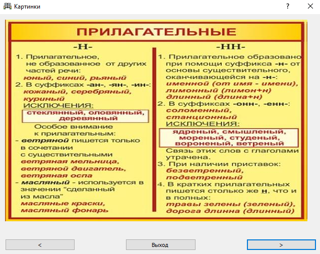

# Школьный справочник
Проект по PyQt Коновалова Александра

<<<<<<< HEAD
* Данная работа предназначена для создания собственного справочника по различным отраслям науки, с целью систематизации, отработки, закрепления и повторения знаний.
* Пользователь может составить собственный системный справочник в зависимости от его личных интересов, для удобного применения.

## ТРЕБОВАНИЯ К ПРОГРАММНЫМ И АППАРАТНЫМ СРЕДСТВАМ
Приложение предназначено для работы на персональных компьютерах с уставленным на них интерпритатором Python версии 3.8 с установленными библиотеками (requirements.txt).
=======
* Данная работа предназначна для создания собственного справочника по различным отраслям науки, с целью систематизации, отработки, закрепления и повторения знаний.
* Пользователь может составить собственный системный справочник в зависимости от его личных интересов для удобного применения.

## ТРЕБОВАНИЯ К ПРОГРАММНЫМ И АППАРАТНЫМ СРЕДСТВАМ
Приложение предназначено для работы на персональных компьютерах с уставленным на них интерпретатором Python версии 3.8 с установленными библотеками (requirements.txt).
>>>>>>> origin/master

## УСТАНОВКА ПРИЛОЖЕНИЯ
### Загрузка
``` 
git clone https://github.com/Ytenochek/QT_Project
cd QT_Project
```
### Запуск
#### Windows
```
py main.py
```
#### Linux
```
python3.8 main.py
```
## РАБОТА С ПРИЛОЖЕНИЕМ
### ГЛАВНОЕ ОКНО ПРИЛОЖЕНИЯ
#### Интерфейс


При запуске приложения  начинается загрузка главного окна
приложения, в котором расположены следующие элементы:
1. Выдвигающийся список уроков для действия с ними.
2. Выдвигающийся список уроков для нахождения информации.
3. Поисковая строчка.
4. Кнопка поиска.
5. Блок кнопок для действий над уроками.
6. Блок кнопок для действия над правилами.
7. Кнопка для отображения подробной информации.
8. Список найденных результатов.
#### Горячие клавиши
* `esc` - выход
* `ctrl + N` - добавить правило
* `ctrl + C` - изменить правило
* `ctrl + Delete` - удалить правило
* `ctrl + Alt` - подробности правила
* `ctrl + shift + N` - добавить урок
* `ctrl + shift + C` - изменить урок
* `ctrl + shift + Delete` - удалить урок
#### Использование
* Для того, чтобы отфильтровать правила по слову, нужно выбрать предмет, ввести нужное слово в ___поисковую строчку (3)___ и нажать на ___кнопку поиска (4)___.
В ___списке результатов (8)___ будут отображены найденные строчки.
* Для проведения действий над правилами, нужно выбрать _одну_ или _несколько_ строчек из ___списка (8)___ и выбрать соответствующую кнопку из ___блока 6___.
* Для проведения действий над уроками, нужно выбрать из ___списка 1___ предмет и выбрать соответствующую кнопку из ___блока 5___.
* Для добавления предмет нужно нажать на кнопку `Добавить предмет` из ___блока 5___ и ввести информацию в появляющихся _диалоговых окнах_.
* Для добавления правила нужно нажать на кнопку `Добавить правило` из ___блока 6___ и ввести информацию в появляющихся _диалоговых окнах_.
### ДОПОЛНИТЕЛЬНЫЕ ОКНА ПРИЛОЖЕНИЯ
__Приложение имеет дополнительные окна для подтверждения действий, ввода информации и изучения подробной информации.__
#### Окно для показа картинок
Если пользователь не выбрал картинки при добавлении правила, то окно будет выглядеть так:


Иначе окно будет отображать их:




##### Горячие клавиши
* `esc` - выход
* `Правая стрелка` - следующая картинка
* `Левая стрелка` - предыдущая картинка
